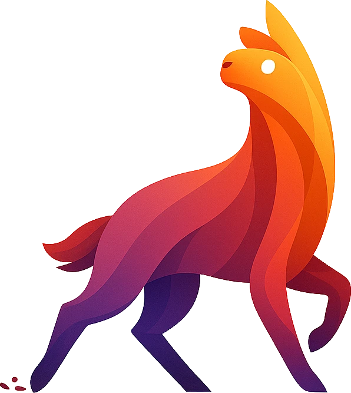
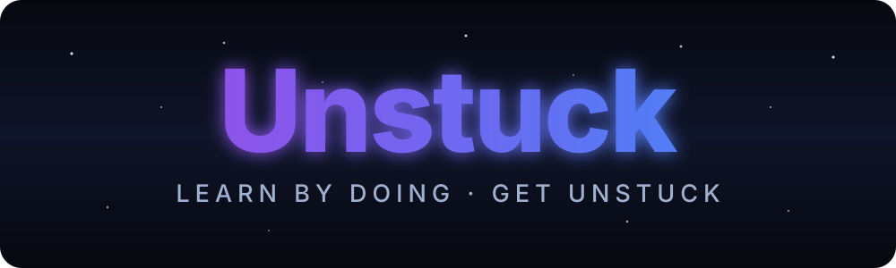

<div align="center">





**A cosmic-themed learning platform that turns watching into doing** — lessons, a lesson‑scoped AI study chat, spaced‑repetition practice, and auto‑graded quizzes, all gated per user.

[**🚀 Live app**](https://unstuck.lukasz-rdzanek.workers.dev) · built on Astro 6 SSR + React 19 islands + Supabase, shipped to Cloudflare Workers.

<br/>


</div>

---

## ✨ What is Unstuck?

Unstuck is a full‑stack learning app for people who get stuck halfway through a course and never finish. Instead of passive video, every lesson is a **workspace**: watch, ask questions in a lesson‑scoped AI chat, mark progress, then prove you learned it with quizzes that are **re‑served on a spaced‑repetition schedule** until they stick. Every resource is tied to the signed‑in user and protected by Postgres Row‑Level Security.

> **The whole project — code, docs, tests, CI/CD, and the AI tooling around it — was built with the 10xDevs AI‑assisted workflow.** This README doubles as the certification map for the three 10xDevs 3.0 badges.

---

## 🏅 Certification badges

This project is submitted for the full set. Every claim below is verifiable in‑repo; the consolidated reviewer map lives in [`context/foundation/badge-evidence.md`](context/foundation/badge-evidence.md), with screenshots under [`context/evidence/`](context/evidence/).

### 🚀 10xBuilder — full‑stack MVP, deployed to the cloud _(mandatory)_

| Requirement                      | How Unstuck meets it                                                                                                                                                                                 |
| -------------------------------- | ---------------------------------------------------------------------------------------------------------------------------------------------------------------------------------------------------- |
| **Access control**               | Email/password auth (Supabase SSR), cookie sessions, route gating in [`src/middleware.ts`](src/middleware.ts)                                                                                        |
| **CRUD over the domain**         | Create/read/update/delete on lesson chat messages, lesson completions, and test attempts — [`src/lib/services/`](src/lib/services/), [`src/pages/api/`](src/pages/api/)                              |
| **Business logic**               | FSRS spaced‑repetition scheduling ([`src/lib/srs.ts`](src/lib/srs.ts)), server‑side quiz grading, AI semantic answer‑matching                                                                        |
| **Context docs**                 | [`prd.md`](context/foundation/prd.md), [`infrastructure.md`](context/foundation/infrastructure.md), [`roadmap.md`](context/foundation/roadmap.md), [`test-plan.md`](context/foundation/test-plan.md) |
| **Tests (user‑perspective)**     | Playwright e2e (sign‑in → take a quiz → graded result) + Vitest unit + RLS integration suite                                                                                                         |
| **CI/CD pipeline**               | [`.github/workflows/ci.yml`](.github/workflows/ci.yml) — lint + test + build on every push/PR, auto‑deploy to Cloudflare on `master`                                                                 |
| **Public URL** _(optional, met)_ | <https://unstuck.lukasz-rdzanek.workers.dev>                                                                                                                                                         |

### 🔧 10xArchitect — architecture, modernization, refactoring, AI at scale

A self‑authored architectural report synthesized from the four Module‑4 artifacts:

- **Repository map** → [`context/map/repo-map.md`](context/map/repo-map.md) (terrain, coupling, risk zones, bus factor)
- **Feature research** → [`context/changes/practice-srs-grading-analysis/research.md`](context/changes/practice-srs-grading-analysis/research.md) (end‑to‑end trace of the grade → reschedule path)
- **Refactoring plan** → [`context/archive/2026-06-13-refactor-opportunities/plan.md`](context/archive/2026-06-13-refactor-opportunities/plan.md) (phased, reversible; implemented + archived)
- **Domain notes (DDD)** → [`context/domain/`](context/domain/) (distillation, invariants/aggregates, anti‑corruption layer, event storming)
- **Synthesis** → [`context/evidence/architect/architect-report.md`](context/evidence/architect/architect-report.md)

Backed by a repeatable **plan → implement → impl‑review → archive** loop across 28 archived changes ([`context/archive/`](context/archive/)) and load‑bearing invariants captured as rules ([`context/foundation/lessons.md`](context/foundation/lessons.md)).

### 🏆 10xChampion — AI inside a modern dev team _(two independent live projects)_

| Project                        | What it is                                                                                                        | Where                                                                                                                             |
| ------------------------------ | ----------------------------------------------------------------------------------------------------------------- | --------------------------------------------------------------------------------------------------------------------------------- |
| **AI code‑review pipeline**    | A Claude‑Agent‑SDK reviewer running in CI, scoring PRs against a 6‑criterion rubric and posting a verdict comment | [`tools/code-review-agent/`](tools/code-review-agent/) · [`.github/workflows/review.yml`](.github/workflows/review.yml)           |
| **Shared AI toolkit registry** | An npm package (skills + rules + installer) published to GitHub Packages for team reuse                           | [`tools/ai-toolkit/`](tools/ai-toolkit/) · [`.github/workflows/publish-ai-toolkit.yml`](.github/workflows/publish-ai-toolkit.yml) |

Lesson‑by‑lesson artifacts (M5L1–L5): opportunity map & Mom‑test, the team agent, code review in CI, the shared registry, and an async‑delegation boundary contract — see [`context/foundation/`](context/foundation/).

---

## 🧩 Features

- **Course catalog & lessons** — browse courses, watch lessons in a custom Plyr‑based cinema player, navigate chapters.
- **Lesson‑scoped AI chat** — ask questions per lesson; messages stream in real time via Supabase Realtime, RLS‑isolated per user.
- **AI answer‑matching** — when you post a question, pgvector semantic search surfaces the best prior answer as a dismissible suggestion (Cloudflare Workers AI embeddings).
- **Spaced‑repetition practice** — missed quiz questions are rescheduled with the FSRS‑6 algorithm; a per‑course `/practice` view drives the review loop.
- **Auto‑graded quizzes** — A/B/C/D tests graded server‑side via `SECURITY DEFINER` functions so the answer key never reaches the client.
- **Progress tracking** — mark lessons complete; completions persist per user.
- **Operator moderation** — operator‑only message moderation and content seeding paths.
- **Auth & accounts** — sign‑up with email confirmation, sign‑in, protected routes, light/dark cosmic theme toggle.

---

## 🏗️ Architecture

- **Astro 6 SSR** (`output: "server"`) with **React 19 islands** — Astro for markup that renders once, React only where there's state or an event handler (chat, forms, live updates).
- **Supabase** — Postgres + Auth + Realtime. **Row‑Level Security on every table**, with per‑operation/per‑role policies; sensitive logic in `SECURITY DEFINER` functions.
- **pgvector + Cloudflare Workers AI** — `bge-base-en-v1.5` 768‑dim embeddings power semantic answer‑matching.
- **FSRS‑6 scheduling** — the spaced‑repetition engine, kept and re‑pointed onto quiz questions.
- **Edge deployment** — Cloudflare Workers via the `@astrojs/cloudflare` adapter (`nodejs_compat`).
- **Conventions** — Astro vs React boundary, `cn()` for class merging, shadcn/ui (new‑york), zod‑validated API routes (`prerender = false`). Full guide in [`AGENTS.md`](AGENTS.md).

---

## 🤖 AI in the development process

- **10x workflow** — every change ran shape → plan → implement → impl‑review → archive, each with a `## Progress` contract and SHA‑stamped phases.
- **Context as source of truth** — a single centralized [`context/`](context/) holds the PRD, roadmap, infrastructure, test plan, domain model, lessons, and per‑change history.
- **AI code review in CI** — see the [10xChampion](#-10xchampion--ai-inside-a-modern-dev-team-two-independent-live-projects) section.
- **Shared AI toolkit** — reusable skills and rules distributed as a versioned package.

---

## 🧪 Testing

Risk‑driven, layered (strategy in [`context/foundation/test-plan.md`](context/foundation/test-plan.md)):

| Layer       | Tool                    | Covers                                                                                      | Command                    |
| ----------- | ----------------------- | ------------------------------------------------------------------------------------------- | -------------------------- |
| Unit        | Vitest                  | SRS scheduling, embeddings, middleware gating, open‑redirect guard, auth validation         | `npm run test`             |
| Integration | Vitest + local Supabase | RLS invariants: answer‑key protection, IDOR, gated courses, grading oracle, match isolation | `npm run test:integration` |
| E2E         | Playwright              | User flow: sign‑in → take a quiz → see the graded result; auth gating                       | `npm run test:e2e`         |
| Mutation    | Stryker                 | Test‑suite strength                                                                         | `npm run test:mutation`    |

---

## 🚦 CI/CD

[`.github/workflows/ci.yml`](.github/workflows/ci.yml):

- **CI** (every push & PR) — `lint` → `test` (unit) → `build`, plus a leak‑check gate (no `127.0.0.1` in the bundle, prod key present).
- **CD** (`master` only, gated on green CI) — `npx wrangler deploy` to Cloudflare Workers, cancel‑in‑progress so newest `master` wins.
- **Integration & E2E** jobs (PR + manual dispatch) boot a local Supabase stack; deliberately isolated from deploy so Docker flake never blocks prod.
- Plus the two Champion workflows: [`review.yml`](.github/workflows/review.yml) (AI code review) and [`publish-ai-toolkit.yml`](.github/workflows/publish-ai-toolkit.yml).

---

## 📁 Project structure

```
.
├── src/
│   ├── pages/          # Astro pages + API routes (api/)
│   ├── components/      # Astro layout components & React islands (chat, lesson, ui)
│   ├── lib/            # services/, srs.ts, embeddings.ts, supabase clients
│   ├── middleware.ts    # auth + route gating
│   └── types.ts         # shared entities & DTOs
├── supabase/migrations/ # RLS schema + SECURITY DEFINER functions
├── tests/integration/    # RLS invariant suite (local stack)
├── e2e/                  # Playwright specs
├── tools/
│   ├── code-review-agent/ # 10xChampion #1 — AI reviewer
│   └── ai-toolkit/        # 10xChampion #2 — shared registry package
├── context/             # PRD, roadmap, domain model, change history, evidence
└── .github/workflows/    # ci.yml, review.yml, publish-ai-toolkit.yml
```

---

## 🛠️ Getting started

**Prerequisites:** Node.js 22 (see `.nvmrc`), Docker (for the local Supabase stack, ~7 GB RAM).

```bash
git clone https://github.com/lukasz-rdzanek/unstuck.git
cd unstuck
npm install

# Local Supabase (Postgres + Auth + Realtime)
npx supabase start          # prints SUPABASE_URL + anon key on first run
npx supabase db push        # apply migrations (RLS schema + functions)

# Env: copy the printed credentials into .env and .dev.vars
cp .env.example .env
cp .env.example .dev.vars
#   SUPABASE_URL=http://127.0.0.1:54321
#   SUPABASE_KEY=<anon key from the CLI output>

npm run dev                 # http://localhost:4321 (Cloudflare workerd runtime)
```

> ⚠️ Never run `supabase db reset` — it wipes local auth users. Use `npx supabase migration up` / `db push` instead. Local Studio: `http://localhost:54323`.

### Scripts

| Script                        | Purpose                                         |
| ----------------------------- | ----------------------------------------------- |
| `npm run dev`                 | Dev server (Cloudflare workerd)                 |
| `npm run build`               | Production build                                |
| `npm run preview`             | Preview the production build                    |
| `npm run lint` / `lint:fix`   | ESLint (type‑checked)                           |
| `npm run format`              | Prettier                                        |
| `npm run test` / `test:watch` | Vitest unit tests                               |
| `npm run test:integration`    | RLS integration suite (needs local Supabase)    |
| `npm run test:e2e`            | Playwright e2e (needs dev server + local stack) |
| `npm run test:mutation`       | Stryker mutation testing                        |

---

## ☁️ Deployment

Deploys to **Cloudflare Workers**. On merge to `master`, CI builds with the prod `SUPABASE_URL`/`SUPABASE_KEY` secrets and runs `npx wrangler deploy` automatically. DB migrations are **not** in CD — run `npx supabase db push` against the cloud project _before_ merging a migration‑bearing change. Manual deploy:

```bash
npm run build
npx wrangler deploy
```

Set `SUPABASE_URL`, `SUPABASE_KEY`, `CLOUDFLARE_API_TOKEN`, and `CLOUDFLARE_ACCOUNT_ID` as repository/Cloudflare secrets. See [`context/foundation/infrastructure.md`](context/foundation/infrastructure.md) for the platform rationale and risk register.

---

## 📚 Documentation map

| Doc                                          | What                                                                    |
| -------------------------------------------- | ----------------------------------------------------------------------- |
| [`AGENTS.md`](AGENTS.md)                     | Conventions, tripwires, architecture pointers for AI agents             |
| [`CONTRIBUTING.md`](CONTRIBUTING.md)         | Branch → PR → CI → review → merge workflow                              |
| [`context/foundation/`](context/foundation/) | PRD, roadmap, infrastructure, test plan, domain lessons, badge evidence |
| [`context/domain/`](context/domain/)         | DDD domain model (10xArchitect)                                         |
| [`context/archive/`](context/archive/)       | 28 archived changes — the full build history                            |

---

## 📄 License

MIT — see [`LICENSE`](LICENSE).

---

## ▶️ Download & run

Get it running locally from scratch:

```bash
# 1. Clone
git clone https://github.com/lukasz-rdzanek/unstuck.git
cd unstuck

# 2. Install dependencies (Node.js 22 — see .nvmrc)
npm install

# 3. Start the local Supabase stack (needs Docker, ~7 GB RAM)
npx supabase start          # prints SUPABASE_URL and the anon key
npx supabase db push        # apply migrations: RLS schema + SECURITY DEFINER functions

# 4. Configure environment — paste the printed credentials
cp .env.example .env
cp .env.example .dev.vars
#   SUPABASE_URL=http://127.0.0.1:54321
#   SUPABASE_KEY=<anon key from the supabase start output>

# 5. Run the dev server
npm run dev                 # → http://localhost:4321
```

Then open <http://localhost:4321>, sign up at `/auth/signup`, and start a course.

**Verify your setup:**

```bash
npm run test                # unit tests (no Docker needed)
npm run test:integration    # RLS invariants (local Supabase must be running)
npm run test:e2e            # browser flow: sign in → take a quiz → graded result
```

> ⚠️ Never run `supabase db reset` (it wipes local auth users) — use `npx supabase migration up` / `db push`. Stop the stack with `npx supabase stop`; local Studio is at `http://localhost:54323`.

To deploy your own copy to Cloudflare Workers, see [☁️ Deployment](#️-deployment) above.
