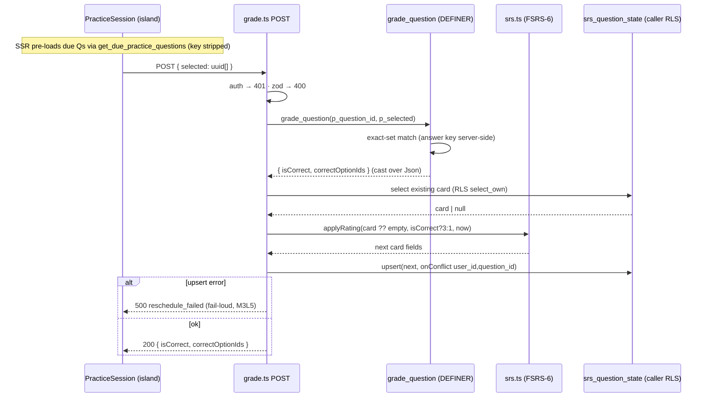

# Research: practice grade → SRS reschedule (Deep Focus)

**Target (from the map).** Risk zone #5 of [`context/map/repo-map.md`](../../map/repo-map.md)
— _Practice / SRS / grading_: core business logic over Postgres RPCs,
correctness-sensitive, easy to break subtly. **Entry point** (from "First day"):
[`src/pages/api/practice/[questionId]/grade.ts`](../../../src/pages/api/practice/%5BquestionId%5D/grade.ts).
**Why this area:** the map flagged it as a sensitive zone touching the
`lib/supabase.ts` hub and RPC runtime coupling that no import graph can see —
exactly the kind of behaviour a static map can't explain. This is Deep Focus:
trace the real flow, find the debt, stop before refactor (that is M4L4).

## Research Question

How does grading one practice (re-quiz) question and rescheduling its SRS card
_actually_ work end-to-end, what is tested vs not, and what must change together
if we touch it? Evidence over directory structure; `evidence`/`inference`/`unknown`
kept explicit.

## Summary

A single `POST /api/practice/[questionId]/grade` is **two DB round-trips, not
one**: (1) a `grade_question` SECURITY DEFINER RPC computes correctness with the
answer key kept server-side, then (2) the handler reads the existing FSRS card,
advances it via `src/lib/srs.ts`, and upserts it back — **under the caller's RLS,
not the definer**. The route name ("grade") hides both the two-phase shape and
the definer/caller security split. Grading is **fail-loud** (a failed reschedule
returns 500, fixed in M3L5 `c6f9209`) — deliberately unlike its sibling
`tests/submit`, which is best-effort. The real technical debt is **not** the
biggest file; it is **silent, tooling-unguarded coupling**: a 9-column card
contract duplicated as three byte-identical string literals across three routes,
an RPC return shape consumed via an unchecked `as` cast over `Json`, and a shared
FSRS hub (`srs.ts`) whose blast radius the git history _under-reports_. A large
chunk of apparent coupling (`database.types.ts` ↔ `types.ts`) is **cheap
regeneration**, not real debt — the report separates the two.

---

## 1. Feature overview

### End-to-end trace (evidence — every step cited)

1. **Queue pre-load (SSR).** `practice.astro` calls `getDuePracticeQuestions(supabase, course.id)` and hands results to the client island — `src/pages/courses/[slug]/practice.astro:13,29`. That service calls RPC `get_due_practice_questions` (SECURITY DEFINER, `stable`; gated by `has_course_access`; `s.due <= now()`, ordered soonest-first; **options stripped of `is_correct`**) — `src/lib/services/tests.ts:65-72`, `supabase/migrations/20260607100000_srs_question_state.sql:52-77`.
2. **Auth.** Every request resolves the user via `supabase.auth.getUser()` → `context.locals.user` — `src/middleware.ts:21-27`. The page path matches `COURSE_PRACTICE_RE` and is gated; the **`/api/practice/...` route is NOT in `isProtectedRoute`** — it self-checks (step 4) — `src/middleware.ts:7,12,55-59`.
3. **Client POST.** On "Check", `fetch('/api/practice/${q.id}/grade', {method:'POST', body:{selected}})` — `src/components/test/PracticeSession.tsx:31-50`.
4. **Handler guards.** 401 if no `locals.user.id` (`grade.ts:32-35`); 400 `missing_question_id` (`:36-39`); 400 `invalid_json` (`:41-46`); zod `{selected: uuid[]}` with a **lenient** UUID regex → 400 `invalid_selection` (`:21-23,47-50`); 500 `supabase_not_configured` (`:52-55`).
5. **Grade (RPC, phase 1).** `supabase.rpc("grade_question", {p_question_id, p_selected})` → 500 `grade_failed` on error; result **cast** to `{isCorrect, correctOptionIds}` — `grade.ts:57-65`. The PL/pgSQL (SECURITY DEFINER, `stable`, `set search_path=public`) raises `unauthenticated`/`question_not_found`/`no_access`, then does an **exact-set match**: `v_correct = array_agg(id order by id) where is_correct`, `v_is := v_selected = v_correct` — `migrations/20260607100000_srs_question_state.sql:82-110`. The answer key never reaches the client.
6. **Reschedule (phase 2, caller RLS).** Read existing card `select CARD_COLUMNS from srs_question_state where user_id, question_id .maybeSingle()` (`grade.ts:8,74-79`); compute next via `applyRating(existing ?? emptyCardFields(now), isCorrect ? 3 : 1, now)` — **correct→Good(3), wrong→Again(1)** (`grade.ts:80`); FSRS-6 through `ts-fsrs` (`src/lib/srs.ts:19,71-74`); upsert `onConflict user_id,question_id` (`grade.ts:81-86`). All under `srs_question_state_*_own` RLS (`migration:39-48`).
7. **Fail-loud.** Upsert error or any throw → 500 `reschedule_failed` (`grade.ts:87-94`). Deliberate (M3L5 comment `:67-71`): a swallowed write leaves `due` unmoved and re-serves the same card forever.
8. **Response.** 200 `{isCorrect, correctOptionIds}` (`grade.ts:96`); client colours options + shows "see again soon / scheduled further out" — `PracticeSession.tsx:56,93,121-148`.

### What the route name / folder tree hides (inference)

- **"Grade one question" is two round-trips**, with a **security split**: phase 1
  runs as definer (answer key hidden), phase 2 runs as the caller (RLS-owned card
  write). You cannot see this from the route name or the folder layout — only the
  trace shows it.
- **`srs.ts` is a shared FSRS hub**, not a practice-only helper: the same
  `applyRating`/`emptyCardFields` serves **three** routes over **two** tables —
  practice grade + tests submit (`srs_question_state`) and lesson reviews rate
  (`srs_review_state`) — `grade.ts:4,80`, `submit.ts:4,99,106`, `rate.ts:4,76`.
- **Sibling asymmetry by design:** `grade` is fail-loud (`grade.ts:89`); `tests/submit`
  is best-effort — wrong→enrol+Again, correct-with-card→Good, correct-first-timer→
  skipped, failures **swallowed** (`submit.ts:104-121`); `reviews/rate` is fail-loud
  (`rate.ts:86`). `submit_test_attempt` is also `volatile` and writes
  `test_attempts`/`attempt_answers` + score/passed — a different shape from the
  read-only `grade_question` (`migrations/20260606170000_tests_schema.sql:138-190`).

---

## 2. Technical debt

A map of **fragility**, not a list of ugly files. Each item tagged by _kind_:
**SILENT** (no compiler/tooling guard), **RUNTIME** (invisible to the import
graph), **REGENERATION** (cheap, automated — looks scary, isn't), **TEST-GAP**.

### Risk map (evidence)

| #   | Debt                                                                    | Kind                             | Why it bites                                                                                                                                                                                                                                                               | Evidence                                                                                                                                              |
| --- | ----------------------------------------------------------------------- | -------------------------------- | -------------------------------------------------------------------------------------------------------------------------------------------------------------------------------------------------------------------------------------------------------------------------- | ----------------------------------------------------------------------------------------------------------------------------------------------------- |
| D1  | **`CARD_COLUMNS` duplicated ×3** + `SrsCardFields` Pick + SQL DDL       | **SILENT (highest)**             | A card-column change needs a 5-place lockstep edit; the 3 string literals are **not** compiler-checked against the table and **never co-change in git** → a stale literal is a runtime `.select()` error, not a build break                                                | `grade.ts:8`, `rate.ts:24`, `submit.ts:6` (byte-identical); Pick `srs.ts:22-25`; DDL `20260607100000_srs_question_state.sql`                          |
| D2  | **`grade_question` return consumed via `as` cast** over `Returns: Json` | **RUNTIME**                      | Rename a return field in SQL → TS still compiles → `result.correctOptionIds` silently `undefined`. Zero compile safety on the return shape (args _are_ typed)                                                                                                              | `grade.ts:65`; `database.types.ts:617-620` (`Returns: Json`)                                                                                          |
| D3  | **`srs.ts` hub coupling is hidden by git history**                      | **RUNTIME / process**            | Import graph proves `srs.ts` feeds 3 routes/2 tables, but `srs.ts` has only 2 commits and **never co-changed with `srs_question_state.sql`** — a reviewer trusting git co-change alone misses the blast radius; a hub edit must also respect 3 different failure contracts | `srs.ts:22-72`; callers `grade.ts`/`submit.ts`/`rate.ts`; git: srs.ts born in `9fc2bc6`, reused in `5633f4e` without being touched                    |
| D4  | **`grade_failed` (RPC error) branch untested** for grade                | **TEST-GAP**                     | The 500 RPC-error path (`grade.ts:61-64`) has no test; only `submit` has the analogue                                                                                                                                                                                      | `route-contracts.test.ts:124-129` (submit only); `grade.test.ts:25,69` always `error:null`                                                            |
| D5  | **`invalid_selection` / UUID regex never exercised**                    | **TEST-GAP**                     | Only malformed-JSON is tested; a JSON-valid-but-schema-invalid body (`{selected:["not-uuid"]}`) never hits `grade.ts:47-50` → the regex (`:22-23`) is unverified                                                                                                           | `route-contracts.test.ts:79-83` (asserts `invalid_json` only)                                                                                         |
| D6  | **No DB/e2e coverage of the reschedule round-trip**                     | **TEST-GAP (the dangerous one)** | Unit tests stub Supabase (fake ignores `.eq`/RLS), so `grade_question` SQL + RLS + the actual `srs_question_state` upsert are **never run together**. Integration covers RPC _access_ and card _RLS isolation_ but not a grade→upsert round-trip; no e2e for practice      | harness `fake-supabase.ts:5-8,53-74`; `course-access.itest.ts:89-103`, `idor.itest.ts:121-205`; `e2e/test-taking.spec.ts` covers submit, not practice |
| D7  | **FSRS scheduling numbers not pinned**; service layers untested         | **TEST-GAP**                     | `srs.test.ts` asserts only relative ordering + reps (no golden intervals); `answer-match.ts` and `tests.ts` have **no** unit tests and are mocked at the endpoint boundary                                                                                                 | `srs.test.ts:19-22`; `match-answer.test.ts:12` (mocks the service); no `answer-match.test.ts`/`tests.test.ts`                                         |

### The cheap coupling — do NOT mistake for debt (evidence)

- **`database.types.ts` ↔ `types.ts` (5 shared commits — tightest pair in the repo)
  is REGENERATION**, not real debt: every migration that regenerates the Supabase
  types also re-derives the `types.ts` aliases, committed in one shot. Mechanical,
  CI-shaped, low cost. `database.types.ts` header carries the regen command
  (`types.ts:4-8`). Counting this as "high coupling" would be the classic mistake
  the map warns about. _Caveat (unknown):_ no hook re-runs `supabase gen types` to
  detect a **drifted** generated file — the regen is contingent on a human running
  it (lint-staged only runs eslint/prettier).

### Handler branch coverage (evidence)

| Branch (`grade.ts`)                  | Covered? | Evidence                               |
| ------------------------------------ | -------- | -------------------------------------- |
| 401 unauthenticated                  | ✅       | `route-contracts.test.ts:69-73`        |
| 400 missing_question_id              | ✅       | `route-contracts.test.ts:74-78`        |
| 400 invalid_json                     | ✅       | `route-contracts.test.ts:79-83`        |
| 400 invalid_selection (zod/regex)    | ❌       | no schema-invalid body fed (D5)        |
| 500 supabase_not_configured          | ✅       | `route-contracts.test.ts:84-89`        |
| 500 grade_failed (RPC error)         | ❌       | no grade-route test (D4)               |
| 500 reschedule_failed (upsert error) | ✅       | `grade.test.ts:67-78`                  |
| 500 reschedule_failed (thrown/catch) | ❌       | fake never throws → `:91-94` unreached |
| 200 + correct→3 / wrong→1 mapping    | ✅       | `grade.test.ts:44-60`                  |

Test wiring confirmed live: `vitest.config.ts` defines `unit` + `integration`
projects; **CI runs `npm run test:integration` and `npm run test:e2e`**
(`.github/workflows/ci.yml:109,147`) — the DB-level coverage is not dormant.

---

## Code references

- `src/pages/api/practice/[questionId]/grade.ts` — the flow (entry, RPC, reschedule, fail-loud).
- `src/lib/srs.ts:22-74` — FSRS-6 wrapper; the shared hub (D3).
- `supabase/migrations/20260607100000_srs_question_state.sql:30-110` — table + RLS + `grade_question`/`get_due_practice_questions` RPCs.
- `src/pages/api/tests/[testId]/submit.ts`, `src/pages/api/reviews/[lessonId]/rate.ts` — sibling SRS writers (different failure contracts).
- `src/lib/db/database.types.ts:617-620` — `grade_question` typed Args / opaque `Json` return (D2).
- `src/test/harness/fake-supabase.ts:5-8` — why unit tests don't exercise RLS/RPC (D6).

## Historical context (prior changes)

- `context/archive/2026-06-06-spaced-repetition-review/` — origin of `srs.ts` + `srs_review_state`.
- `context/archive/2026-06-06-learning-loop/` — `srs_question_state` + practice re-quizzing (born with grade.ts/submit.ts).
- `context/archive/2026-06-07-ai-answer-matching/` — `match_lesson_answers` sibling.
- `context/archive/2026-06-07-testing-grading-srs-integration/` + `testing-access-control-rls/` — the integration/IDOR coverage cited above.
- M3L5 `c6f9209` "propagate failed reschedule" — made grade fail-loud (the swallowed-error fix).

## Open questions / unknowns

- **U1 — `has_course_access(uuid)` semantics** (enrollment vs ownership): referenced by both RPCs, defined in an earlier migration, not read here.
- **U2 — generated-types drift guard:** is any CI/pre-commit step re-running `supabase gen types`? If not, D-cheap can silently rot into real debt.
- **U3 — FSRS default parameters / `ts-fsrs` version pin:** exact interval math not verified in-repo (only relative ordering).
- **U4 — `should-sync-but-doesn't`:** does the backend card contract have a hand-maintained client mirror that co-change can't reveal? (the map's classic unknown — not found, but not disproven.)

## § ast-grep verification (structural claims)

Method: `ast-grep -p '<pattern>' -l ts src` — AST-precise (ignores comments and
strings, distinguishes `Save` from `SaveMultiple`). Per the lesson rule, every
potential zero is cross-checked with a plain `grep` so a bad pattern can't read
as "no occurrences".

| Claim                                 | ast-grep pattern                  | Result                                                                                                          | Verdict                                                                                                                                                                                            |
| ------------------------------------- | --------------------------------- | --------------------------------------------------------------------------------------------------------------- | -------------------------------------------------------------------------------------------------------------------------------------------------------------------------------------------------- |
| **D1** — `CARD_COLUMNS` ×3            | `const CARD_COLUMNS = $A`         | **3** — `grade.ts:8`, `rate.ts:24`, `submit.ts:6`                                                               | **CONFIRMED**. Same 9-column value (`grep -u` → one unique string; `rate.ts` only wraps it across two lines).                                                                                      |
| **D2** — `grade_question` called once | `$X.rpc("grade_question", $$$A)`  | **1** — `grade.ts:57`                                                                                           | **CONFIRMED**. `grep` cross-check: `grade_question` elsewhere is only the SQL def (`migration:82`), the generated type (`database.types.ts:617`) and comments — **no hidden string-built caller**. |
| RPC sites (context)                   | `$X.rpc($$$A)`                    | **8** — answer-match:43, backfill:53/74/91, grade:57, tests:53/66, submit:65                                    | informational — the flow's RPCs (`grade_question`, `get_due_practice_questions`, `submit_test_attempt`, `match_lesson_answers`) all accounted for.                                                 |
| **D3** — `srs.ts` hub                 | `applyRating($$$A)`               | **6** → **4 production** call-sites across **3 routes** (grade:80, submit:99+106, rate:76) + 2 in `srs.test.ts` | **CONFIRMED, refined**: 3 routes / 2 tables, but **4** call-sites (`submit` calls it twice). Original "3 routes" stands; the per-site count is 4.                                                  |
| grade mapping correct→3 / wrong→1     | `applyRating($A, $B ? 3 : 1, $C)` | **1** — `grade.ts:80`                                                                                           | **CONFIRMED**. The `?3:1` rating shape is **unique to grade**; `submit`/`rate` use different mappings — so the practice "Good/Again only" rule is not shared.                                      |

**Net:** every structural claim holds; one refinement (D3 = 3 routes but 4
call-sites). Nothing refuted. No suspicious zeros — each pattern matched, and the
`grade_question` grep cross-check confirms the single call-site is real, not a
pattern artifact.

---

_Stop point (M4L3): this is evidence collection only. Deciding what to change —
e.g. collapsing the three `CARD_COLUMNS` literals or typing the `grade_question`
return — is M4L4 (refactor planning), which consumes this `research.md`._
