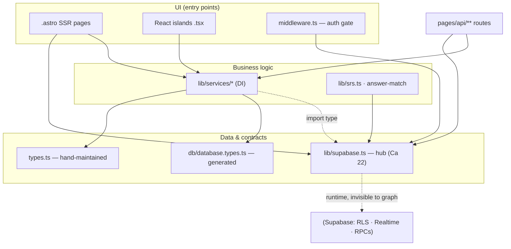

# Repo Map — Unstuck

Decision-ready onboarding map. Synthesised from three evidence artifacts in this
folder ([[artifact-1-territory]] · [[artifact-2-structure]] ·
[[artifact-3-contributors]]). Read this in ~15 minutes to know where things
live, what is dangerous, and where to start. It is a map of **activity and
structure**, not a quality audit.

## 1. TL;DR

Unstuck is an **Astro 6 SSR learning app** (React 19 islands, Tailwind 4,
Supabase auth+data, deployed to Cloudflare Workers) — an MVP, ~17 days and 198
commits old, now in a testing/hardening phase. Work concentrates in one vertical:
the **course → lesson learning flow** (`pages/courses` + `components/lesson`),
with a lesson-scoped **Realtime chat**, a **practice/SRS** loop with AI answer
matching, **auth**, and an **API surface** under `pages/api`. Everything rests on
two pillars: `src/lib/supabase.ts` (the SSR client — imported by **22** modules,
the single biggest blast radius) and the **DB contract** (migrations →
_generated_ `database.types.ts` → services). The architecture is clean: **no
import cycles**, services take the Supabase client by **dependency injection**,
and layers point strictly downward. Where it "hurts" is not tangled code but
**invisible runtime coupling** — RLS policies, Realtime subscriptions, and RPCs
that no import graph can see. Knowledge has a **bus factor of 1** (one human
author); the substitute is the unusually rich `context/` archive.

## 2. Terrain — where the system lives

- **Core (deep, active):** `pages/courses` + `components/lesson` — the lesson
  flow; busiest file `[lessonSlug].astro` (20 changes, efferent 13). The
  composition root of the whole app.
- **Core (runtime-heavy):** `components/chat` — lesson-scoped Realtime chat
  (21 changes). Looks like a leaf in the import graph but is heavy at runtime.
- **Business logic:** `lib/services/*`, `lib/srs.ts`, `lib/answer-match` — the
  practice/SRS/grading loop. Small, deep, highly testable (DI).
- **Supporting:** `pages/api/**` (endpoints), `components/auth` + `middleware.ts`
  (auth), `layouts/*` (shells).
- **Periphery / not product:** `context/**` (241 changes) and `.claude/**` are
  the 10x **dev-process** record, not application code — high churn there is
  expected and is **not** a hotspot.
- **Activity over time:** W22 build-up → **W23 peak** → W24 tapering. Everything
  is "volatile" simply because the repo is young; no stable/seasonal contrast yet.

## 3. Real connections — what actually moves together

| Coupling                                  | Evidence                           | Kind                                                           |
| ----------------------------------------- | ---------------------------------- | -------------------------------------------------------------- |
| `pages/courses` ↔ `components/lesson`     | co-change (git) + efferent (graph) | hand edit — the lesson vertical moves as one                   |
| `migrations` → `database.types.ts`        | co-change 8 (git)                  | **regeneration** — cheap, auto, don't count as design coupling |
| `migrations` → `services` / `types.ts`    | co-change 6 (git)                  | **hand edit** — the real cost of a schema change               |
| everything → `lib/supabase.ts`            | afferent 22 (graph)                | hand edit — change it and the repo feels it                    |
| `components/test/*` → `services/tests.ts` | graph edge                         | **type-only** (erased at build) — benign, not a layer breach   |
| chat island ↔ DB                          | _neither_ git nor graph            | **runtime** (Realtime/RLS) — `unknown`, verify in Deep Focus   |

Layers point downward (UI → services → data); **no cycles**. Note: the structure
evidence is a **custom import scan** — dependency-cruiser could not resolve the
`@/*` alias, so its graph was discarded (see Artifact 2).

## 4. Risk zones (handle with care)

1. **`src/lib/supabase.ts`** — afferent 22; the one module the whole app depends
   on. Any change to the client/session shape ripples everywhere.
2. **DB schema (`supabase/migrations` + RLS)** — a migration regenerates
   `database.types.ts` and hand-ripples into services/`types.ts`; **RLS policies
   are invisible to every tool here** yet gate all data access. Highest "surprise"
   potential.
3. **`src/middleware.ts`** — the auth gate. A bug silently exposes protected
   routes (security). New protected routes must extend `isProtectedRoute`.
4. **Lesson chat (Realtime)** — `postgres_changes` + browser client + RLS:
   runtime coupling the import graph cannot show; spans server + client.
5. **Practice / SRS / grading** — business logic over RPCs
   (`get_due_practice_questions`, `match-answer`, grading); correctness-sensitive,
   easy to break subtly.
6. **`[lessonSlug].astro`** — efferent 13; the most-wired page. Touching a hub it
   depends on tends to surface here first.

## 5. Who to ask

Bus factor is **1** — `Lukasz Rdzanek` authored all 198 commits (AI co-authors
aside). There is no second person; the **`context/` archive is the contributor
map**. Per zone, read the plan before changing:

| Zone                     | Ask    | Read first                                                                     |
| ------------------------ | ------ | ------------------------------------------------------------------------------ |
| supabase / data / RLS    | Lukasz | `archive/2026-06-07-testing-access-control-rls`, `foundation/tech-stack.md`    |
| DB schema / migrations   | Lukasz | the relevant `archive/<change>/plan.md` + `supabase/migrations/`               |
| chat / Realtime          | Lukasz | `archive/2026-05-29-lesson-scoped-chat`, `2026-05-28-lesson-chat-data-model`   |
| SRS / grading / matching | Lukasz | `archive/2026-06-06-spaced-repetition-review`, `2026-06-07-ai-answer-matching` |
| auth / middleware        | Lukasz | `archive/2026-05-30-signup-email-confirmation`, `AGENTS.md` (auth flow)        |

## 6. First day — read these, in order

1. `AGENTS.md` + `context/foundation/context-architecture.md` — rules & how context is organised.
2. `src/lib/supabase.ts` — the hub; the SSR vs browser client split.
3. `src/middleware.ts` — auth gate + `isProtectedRoute`.
4. `src/types.ts` **and** `src/lib/db/database.types.ts` — the two contracts (hand-maintained vs generated).
5. `src/pages/courses/[slug]/lessons/[lessonSlug].astro` — the app center; how a page composes services + islands.
6. `src/lib/services/courses.ts` — the dependency-injection service pattern (then `tests.ts`).
7. `src/lib/srs.ts` + `src/lib/services/answer-match.ts` — the business logic.
8. `context/foundation/prd.md` + `roadmap.md` — the "why".

## 7. Limitations — what this map does NOT say

- **Window:** the entire ~17-day history, not a representative year. "Active"
  means "active since inception"; there is no long-term stable/volatile signal.
- **Method:** structure is a single **custom import scan** (no second tool
  corroborated it); `.astro` edges are regex-extracted → medium confidence,
  `.ts/.tsx` high.
- **Blind spots:** the import graph cannot see **RLS, Realtime subscriptions,
  RPCs, feature flags, or edge env config**. The DB contract coupling is real but
  invisible — treated as `unknown`, not "no coupling".
- **Activity ≠ importance, regeneration ≠ design coupling.** A hot file may be a
  true center or just where one hard thing kept getting fixed; `database.types.ts`
  churn is auto-generated, not hand-driven.
- This is a map for **deciding where to look**, not a verdict on code quality —
  that is the next step (Deep Focus / M4L3).
